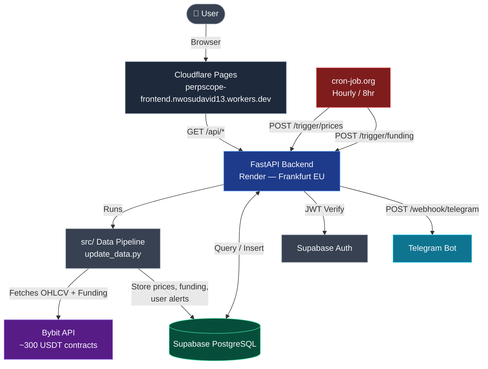

# PerpScope — Altcoin Perpetual Futures Analytics

> Real-time funding rate deviation analytics across ~300 altcoin perpetual futures.

- **Live Platform:** https://perpscope-frontend.nwosudavid13.workers.dev/
- **Research Basis:** He, Manela, Ross & von Wachter (2024) — 
*Fundamentals of Perpetual Futures:* https://papers.ssrn.com/sol3/papers.cfm?abstract_id=4301150

---

## Table of Contents

1. [Overview](#overview)
2. [Features](#features)
3. [Research Foundation](#research-foundation)
4. [Architecture](#architecture)
5. [Repository Structure](#repository-structure)
6. [Alert System Design](#alert-system-design)
7. [Running Locally](#running-locally)
8. [Environment Variables](#environment-variables)
9. [Frontend](#frontend)
10. [Roadmap and Future Work](#roadmap-and-future-work)
11. [Contributing](#contributing)
12. [Docker](#docker)

---

## Overview

PerpScope monitors the gap between perpetual futures prices and their
theoretical no-arbitrage fair values accross ~300 altcoins on Bybit.

When the gap exceeds the trading cost thresholds, a funding rate arbitrage opportunity exists: short the overpriced perpetual, long the spot, collect funding rate payments until prices converge.

PerpScope calculates the value of this "gap" or deviation (ρ) in real time for every monitored coin and alerts traders when opportunities appear.


## Features

- **Real-time mispricing detection** — Monitors ~300 altcoin perpetual futures to identify when contract prices deviate from spot prices
- **Opportunity leaderboard** — Ranked list showing which coins have the largest current mispricing
- **Deep dive analytics** — Historical charts for each coin showing mispricing trends and funding rates over time
- **Market cap research** — Compare how large, mid, and small cap coins behave differently (small caps show larger deviations)
- **Telegram alerts** — Receive phone notifications when opportunities open, intensify, or close (no need to watch the dashboard 24/7)
- **User accounts** — Save your alert preferences and get personalised notifications based on your thresholds

---

## Research Foundation

This project implements and extends the no-arbitrage pricing framework from:

> He, Z., Manela, A., Ross, O., & von Wachter, V. (2024).
> *Fundamentals of Perpetual Futures.*
> SSRN Working Paper. https://ssrn.com/abstract=4301150

The core deviation measure (ρ) from Equation 21 of that paper:

ρ = κ × (F−S)/F + sign(ι−r) × γ − r

Annualized by multiplying by 1095 (i.e 3 funding periods/day x 365 days/year)

**Parameters:**
- κ = 1 (Bybit premium scaling constant)
- ι = 0.0001 (8-hour interest component, 0.01%)
- γ = 0.0005 (clamp width, 0.05%)
- r ≈ 0.0000548 (risk-free rate proxy, ~6% annual stablecoin lending)

**Original contribution:**

This project takes He et al.'s framework—which originally looked at just 5 large-cap coins—and applies it to over 200 altcoins. The goal? To see whether funding rate deviations get bigger or smaller depending on a coin's market cap.

Early results suggest they do. Small-cap altcoins show average |ρ| values that are 3 to 7 times higher than large-cap coins. This makes sense: there's less arbitrage capital flowing through less liquid markets, so price discrepancies stick around longer.

---

## Architecture



- **cron-job.org** (free)
  - Triggers price updates (hourly)
  - Triggers funding rate updates (every 8 hours)
  - HTTP POST to FastAPI backend

- **FastAPI Backend** (Render, Frankfurt EU)
  - Data endpoints for frontend (`/api/opportunities`, `/api/coin/{symbol}`)
  - Automation trigger endpoints (`/trigger/prices`, `/trigger/funding`)
  - User authentication via Supabase JWT
  - Telegram webhook for bot commands (`/webhook/telegram`)

- **Databases**
  - **TimescaleDB**: Time-series storage for perp prices, spot prices, funding rates
  - **Supabase PostgreSQL**: User accounts, alert preferences, authentication

- **Data Pipeline** (`src/`)
  - `collect_historical.py`: One-time historical data pull from Bybit
  - `update_data.py`: Incremental 8-hour (funding) and hourly (price) updates
  - `calculate_rho.py`: Core ρ (rho) deviation calculation engine
  - `telegram_alerts.py`: State-machine alert engine (open/close/intensify)

- **Bybit API**
  - Source of all market data
  - Perpetual futures OHLCV, spot OHLCV, and 8-hour funding rates
  - Covers ~300 USDT-margined altcoin contracts


### Architecture Decision: Single Database

PerpScope currently uses a single Supabase PostgreSQL database for everything — price 
data, user accounts, and alerts.

I actually started with a split setup: time-series price data went into 
TimescaleDB, while user data stayed in Supabase. Why? Because Supabase's 
free tier only gives you 500MB, which filled up fast. But once I added 
the 90-day data retention mechanism, storage wasn't a problem anymore.

I kept running both databases for a while, but then I found out 
TimescaleDB's free tier only lasts a month. So I consolidated everything 
into Supabase before the TimescaleDB expired and broke the system.

Turns out, standard PostgreSQL with good indexing handles our current 
needs just fine — ~300 coins, a 90-day rolling window, about 150MB total data.

If PerpScope ever grow past 500 coins or need to keep data for more than a 
year, we can bring TimescaleDB back. The old connection code is still sitting 
in `backend/database/timescale.py`, so the switch would be straightforward.

---

## Repository Structure
```
perpscope/
│
├── backend/                     # FastAPI backend (deployed on Render)
│   ├── database/
│   │   ├── db_config.py         # Supabase and TimescaleDB urls
│   │   ├── connection.py        # Supabase connection + pool
│   │   ├── timescale.py         # Archived (TimescaleDB reference)
│   │   ├── migrate_to_supabase.py # one-time migration script
│   │   └── supabase.py          # Supabase connection + user queries
│   ├── main.py                  # FastAPI app — all API endpoints
│   └── requirements.txt         # Dependencies specific to the backend and database scripts
│
├── src/                         # Data pipeline
│   ├── config.py                # Coin universe, constants, paths
│   ├── collect_historical.py    # One-time historical data collection
│   ├── update_data.py           # Incremental hourly/8hr updates
│   ├── calculate_rho.py         # He et al. ρ deviation formula
│   ├── calculate_funding.py     # Funding rate display calculations
│   ├── get_universe.py          # Bybit perpetual contract discovery
│   ├── get_market_caps.py       # CoinGecko market cap classification
│   ├── telegram_alerts.py       # State-machine alert engine
│   ├── utils.py                 # Shared utilities (timestamps, custom logging)
│   └── setup_webhook.py         # One-time Telegram webhook registration
│
├── tests/
│   ├── test_calculate_rho.py    # Unit tests for ρ calculation
│   ├── test_connection.py       # Tests connection to Bybit API
│   └── test_api_endpoints.py    # Integration tests for API endpoints
│
├── .github/
│   └── workflows/
│       ├── update_prices.yml    # Hourly price update (GitHub Actions backup)
│       └── update_funding.yml   # 8-hour funding rate update (backup)
│
├── docker/
│   ├── Dockerfile               # Backend container definition
│   └── docker-compose.yml       # Local development stack
│
├── coin_universe.json           # Discovered Bybit perpetual contracts
├── market_cap_classification.json # CoinGecko tier classification
├── pyproject.toml               # Project config, dependencies, and build settings
├── .gitignore
├── .dockerignore
├── README.md
└── requirements.txt             # Global requirements.txt
```
---

## Alert System Design

The Telegram alert engine uses three states — neutral, active, closing — 
so it only messages you when an opportunity actually opens, strengthens, 
or closes, so as to avoid spamming the user:

- NEUTRAL → ACTIVE:   "Opportunity opened" alert sent immediately
- ACTIVE  → CLOSING:  Waits one additional check (avoids false closes)
- CLOSING → NEUTRAL:  "Opportunity closed" alert sent (confirmed close)
- CLOSING → ACTIVE:   Brief dip detected, recovers silently
- ACTIVE  → ACTIVE:   "Intensified" alert only if ρ increases >50%

Users can configure alerts with these three parameters:
- **Market cap tier** — Large/Mid/Small Cap or all
- **Fee tier** — based on the user's actual trading costs (retail/fund/institution)
- **Min ρ** — how big the deviation (ρ) needs to be to get an alert

This ensures every alert represents a genuinely profitable opportunity
for that specific user.

---

## Running Locally

**Prerequisites:** Python 3.11+, Node.js 18+, PostgreSQL

```bash
# Clone
git clone https://github.com/Pointbr8ker-123/PerpScope.git
cd perpscope

# Backend setup
cd backend
python3 -m venv venv
source venv/bin/activate      # Windows: venv\Scripts\activate
pip install -r requirements.txt

# Environment variables
cp .env.example .env
# Edit .env with your DATABASE_URL, BYBIT_API_KEY, etc.

# Run FastAPI locally
python3 main.py
# API available at http://localhost:8000
# Interactive docs at http://localhost:8000/docs

# Run tests
cd ..
cd tests
python3 test_connection.py     # to check for a successful db connection
python3 test_calculate_rho.py
python3 test_api_endpoints.py  # requires running server
```

**Data pipeline:**

```bash
cd ..
cd src

# Discover available Bybit perpetuals
python3 get_universe.py

# Classify by market cap (requires CoinGecko API)
python3 get_market_caps.py

# Collect historical data (run once)
python3 collect_historical.py

# Start incremental updates
python3 update_data.py prices    # hourly prices
python3 update_data.py funding   # 8-hour funding rates
```

---
## Environment Variables

Create a `.env` file based on `.env.example`:

**Database**
- TIMESCALE_URL=postgresql://...        # TimescaleDB connection string
  
- DATABASE_URL=postgresql:...           # Supabase connection string
- SUPABASE_URL=https://xxx.supabase.co  # Supabase website url
- SUPABASE_JWT_SECRET=...
  
**Bybit API**
- BYBIT_API_KEY=...
- BYBIT_SECRET_KEY=...
  
**Telegram**
- TELEGRAM_BOT_TOKEN=...
  
**Automation**
- CRON_SECRET=...                    # Secret key for cron-job.org triggers
- RENDER_URL=https://your-app.onrender.com

---

## Frontend

The frontend (perpscope-frontend repository) was generated using
[Lovable](https://lovable.dev) based on a detailed specification
that matched my FastAPI backend's API responses, and Lovable 
built the React components from that. 

The frontend connects to the FastAPI backend via the endpoints 
documented at `/docs` on the running server.

---

## Roadmap and Future Work

These are the features and improvements I hope to implement in the near future, roughly in priority order based on the goals for this product.

**Research:**
- DAR(2) predictive model (from Inan, 2025) to forecast funding rates. Basically, build an autoregressive model that predicts the next period's rates and shows how accurate it is on the Research page.
- Cross-exchange comparison for BTC and ETH (e.g Bybit vs Binance). This would test whether price deviations are correlated across exchanges, which addresses our current single-exchange limitation.

**Product:**
- Paper trading system - track hypothetical positions, calculate P&L, and prove the signals work before anyone risks real capital.
- Signal history feed - a log of every alert we have fired and what happened afterward, so users (and I) can judge whether the signals are any good.
- Portfolio tracker - for users to monitor open arbitrage positions.
- Paid tier - Nigerian market via Paystack, international via Stripe. Free users get 3 alerts; Pro gets unlimited + Websocket real-time updates.
- Websocket real-time prices - The dashboard currently polls hourly (with funding rates updating every 8hrs). Real-time updares would be better for prompt opportunity detection.

**Infrastructure:**
- TimescaleDB (Hypertables) - the system is currently fine at ~300 coins (plus the 90-day retention system), but if we cross 500+ coins and decide to increase the retention window for research purposes, the current schema will suffer. Hypertables would go a long way to remedy this.
- Redis caching layer - endpoints like `/api/opportunities` and `/api/stats` hit the database on every request. A short Redis cache would cut this load significantly.
- Multi-exchange support (e.g Binance, OKX API adapters)

**Limitations to look into:**
- ρ calculation accuracy depends on good price data — Bybit sometimes gives us bad rows that need manual cleaning
- Alerts only work through Telegram right now; email is planned
- Market cap data requires manual refreshes from CoinGecko (not automated yet)

---

## Contributing

PerpScope is open to contributions. I tried to make it so you can contribute to certain parts without touching or understanding everything else.

**High-impact areas for interested contributors:**

**Data pipeline improvements:**
- Add support for Binance or OKX API as a second data source (`src/collect_historical.py` and `src/update_data.py`)
- Improve the price validation layer to catch more data quality issues before bad rows reach the database
- Implement automatic stale data detection and cleanup
- Extend market cap classification to auto-refresh from CoinGecko API

**Frontend (perpscope-frontend repo):**
- Mobile responsiveness improvements on the CoinDetail page
- Additional chart types (funding rate vs ρ correlation scatter)
- Accessibility improvements (screen reader support, keyboard navigation)

**Getting started as a contributor:**
1. Fork the repository
2. Read the README fully, especially the Architecture section
3. Run the tests: `python tests/test_calculate_rho.py`
4. Pick an issue or improvement from the list above
5. Open a pull request with a clear description of what changed and why

Code style: Use descriptive variable names and add docstrings to all new functions. See existing code for examples.

---

## Docker

The backend can be run in a Docker container for consistent
local development and easier deployment.

**Prerequisites:** Docker and Docker Compose installed.

```bash
# Build and start the backend
docker-compose -f docker/docker-compose.yml up

# Run in background
docker-compose -f docker/docker-compose.yml up -d

# View logs
docker-compose -f docker/docker-compose.yml logs -f

# Stop
docker-compose -f docker/docker-compose.yml down
```

The API will be available at `http://localhost:8000`.
Interactive docs at `http://localhost:8000/docs`.

**Note:** The container connects to your Supabase database via
the `DATABASE_URL` in your `.env` file. No local database setup needed.

---

## Acknowledgements

**Research:**
- He, Z., Manela, A., Ross, O., & von Wachter, V. (2024). *Fundamentals
  of Perpetual Futures.* SSRN 4301150 — the mathematical foundation for
  all ρ calculations in this project.
- Inan, A. (2025). *Predictability of Funding Rates.* SSRN 5576424 —
  motivation for the DAR predictive model (planned).

**Tools and infrastructure:**
- [Bybit API](https://bybit-exchange.github.io/docs/) — market data source
- [Supabase](https://supabase.com) — database and authentication
- [TimescaleDB](https://console.cloud.timescale.com) - time-series database
- [Render](https://render.com) — backend hosting
- [Cloudlfare Pages](https://pages.cloudflare.com) — frontend hosting
- [Lovable](https://lovable.dev) — frontend UI generation (see note below)
- [cron-job.org](https://cron-job.org) — scheduled automation

---

*PerpScope is a research tool. Nothing on this platform is financial advice.*
